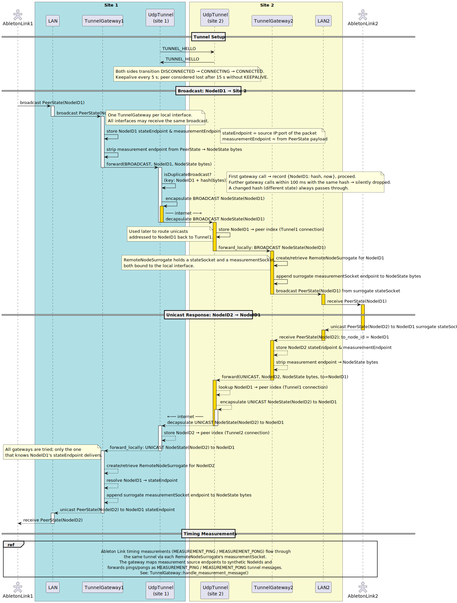

# Ableton Link Extender - documenation.

We can think of two versions of Ableton Link Extender:

- **Version 1**: Act as an 'invisible' pass-through, where each Node on your local network will show up as a Node on the remote network, and vice versa. This will have quite some communication overhead over the internet, as all nodes will need to communicate with each other.

- **Version 2**: Act as a separate Node with a lot of delay on the local network, and pass only the state information over the internet. This will be more efficient, but dives deeper into the Ableton Link protocol.

Currently, we only have the first version implemented.

## Version 1: Invisible Pass-through

### Overview

Most logic is contained in the "TunnelGateway", which acts as a relay between the local network and the Tunnel.
The Tunnel is an abstract concept that can be implemented in multiple ways, such as using shared memory or UDP.

Below included is a sequence diagram of the main flow:

